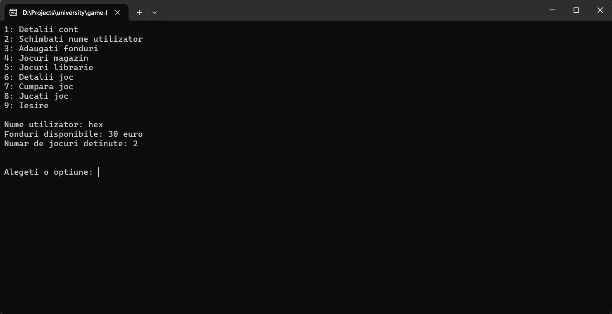

Proiectul reprezinta un sistem de management pentru o librarie si un magazin de jocuri.

Pentru folosire, rulati fisierul "main.exe" si se va deschide un terminal ce contine toate instructiunile necesare pentru folosirea programului.

Structura proiectului:

4 fisiere .h ce contin clasele folosite: joc.h , librarie.h , magazin.h , cont.h
1 fisier .cpp ce contine logica din spatele terminalului: main.cpp

Clasele folosite sunt:
Joc, JocMagazin (mostenit din clasa Joc), Librarie, Magazin, Cont

Functionalitati:  
Detalii cont - Afiseaza numele, suma de bani, si numarul de jocuri detinute  
Schimbati nume utilizator - Schimba numele utilizatorului  
Adaugati fonduri - Adauga o suma de bani la cont  
Jocuri magazin - Afiseaza jocurile disponibile din magazin  
Jocuri librarie - Afiseaza jocurile disponibile din librarie  
Detalii joc - Afiseaza detalii despre un joc  
Cumpara joc - Cumpara un joc din magazin  
Jucati joc - Porneste un joc (⚠️WARNING⚠️: Aceasta comanda chiar porneste jocul pe Steam)  
Iesire - Inchide programul  